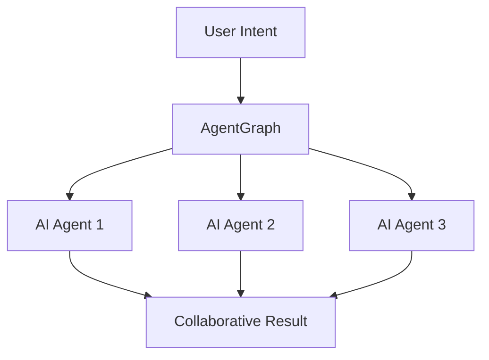

<!-- .slide: class="text-center" data-transition="fade" -->
# **AgentGraph**  
Building the Future of AI

Agent-owned super-agents built on Morpheus + AgentGraph

---

<!-- .slide: data-transition="fade" -->
## The Problem <!-- .element: class="text-mint" -->

<!-- .element: class="fragment fade-in" -->
**🔗 Fragmented AI Ecosystem**  
Current AI agents operate in silos, unable to collaborate or share knowledge effectively.

<!-- .element: class="fragment fade-in" -->
**⚡ Limited Autonomy**  
Most AI systems require constant human oversight and can't make independent decisions.

<!-- .element: class="fragment fade-in" -->
**📊 Data Barriers**  
Valuable insights are trapped in isolated systems, preventing true AI advancement.

---

<!-- .slide: data-transition="fade" -->
## Our Solution <!-- .element: class="text-mint" -->

**🤖 Agent-Owned Networks**  
Self-governing AI agents that can own resources, make decisions, and collaborate autonomously.

**🌐 Decentralized Intelligence**  
Built on Morpheus protocol for truly distributed AI without central control.

**🔄 Seamless Integration**  
AgentGraph connects any AI system through our universal protocol layer.

<!-- .element: class="fragment fade-in" -->

---

<!-- .slide: data-transition="fade" -->
## Market Opportunity <!-- .element: class="text-mint" -->

<h3 class="text-3xl font-bold mb-4">$1.8 Trillion</h3>

Global AI market size by 2030

<h4 class="text-2xl font-bold text-mint">85%</h4>

of enterprises planning AI adoption

<h4 class="text-2xl font-bold text-mint">$13B</h4>

autonomous AI market by 2028

<h4 class="text-2xl font-bold text-mint">200M+</h4>

AI agents predicted by 2025

---

<!-- .slide: data-transition="fade" -->
## Technology Stack <!-- .element: class="text-mint" -->

**🏗️ Infrastructure Layer**
- Morpheus protocol for decentralized AI
- IPFS for distributed data storage
- Ethereum for smart contracts

**🧠 Intelligence Layer**  
- Multi-modal AI agent framework
- Collaborative reasoning protocols
- Real-time knowledge synthesis

**🔌 Integration Layer**
- Universal API gateway
- Cross-platform connectors
- Legacy system bridges

<!-- .element: class="rounded-lg shadow-lg border-2 border-mint" -->

---

<!-- .slide: data-transition="fade" -->
## Competitive Advantage <!-- .element: class="text-mint" -->

| Feature | Traditional AI | **AgentGraph** |
|---------|---------------|----------------|
| Ownership | Corporate controlled | **Agent-owned** |
| Collaboration | Limited APIs | **Native networking** |
| Autonomy | Human supervised | **Fully autonomous** |
| Data Access | Siloed databases | **Decentralized knowledge** |
| Scalability | Linear growth | **Network effects** |

<!-- .element: class="fragment fade-in" -->

<strong>First-mover advantage:</strong> We're building the foundational protocol that all future AI agents will use to collaborate.

<!-- .element: class="fragment fade-in" -->

---

<!-- .slide: data-transition="fade" -->
## Go-to-Market Strategy <!-- .element: class="text-mint" -->

🎯

<h3 class="text-xl font-bold mb-2">Phase 1: Developer Tools</h3>

Launch SDK and dev platform for early adopters

🏢

<h3 class="text-xl font-bold mb-2">Phase 2: Enterprise</h3>

Partner with Fortune 500 for pilot deployments

🌍

<h3 class="text-xl font-bold mb-2">Phase 3: Network</h3>

Scale to millions of autonomous agents

---

<!-- .slide: class="text-center" data-transition="fade" -->
## Join the AI Revolution <!-- .element: class="text-mint" -->

Ready to build the future of autonomous AI?

<button class="bg-mint text-brand-black px-8 py-4 text-xl font-semibold rounded-lg hover:bg-mint-dark hover:shadow-mint transition-all duration-300 transform hover:scale-105">
**Get Early Access**
</button>
<button class="border-2 border-mint text-mint px-8 py-4 text-xl font-semibold rounded-lg hover:bg-mint hover:text-brand-black transition-all duration-300">
**Schedule Demo**
</button>

📧 founders@agentgraph.ai  
🌐 agentgraph.ai  
🐦 @agentgraph

