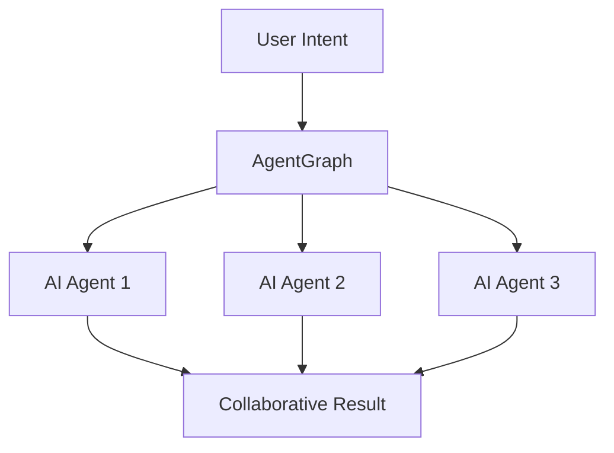

<!-- .slide: class="text-center" data-transition="fade" -->
# **AgentGraph**  
Building the Future of AI

Agent-owned super-agents built on Morpheus + AgentGraph

---

<!-- .slide: data-transition="fade" -->
## The Problem <!-- .element: class="text-mint" -->

<!-- .element: class="fragment fade-in" -->
**🔗 Fragmented AI Ecosystem**  
Current AI agents operate in silos, unable to collaborate or share knowledge effectively.

<!-- .element: class="fragment fade-in" -->
**⚡ Limited Autonomy**  
Most AI systems require constant human oversight and can't make independent decisions.

<!-- .element: class="fragment fade-in" -->
**📊 Data Barriers**  
Valuable insights are trapped in isolated systems, preventing true AI advancement.

---

<!-- .slide: data-transition="fade" -->
## Our Solution <!-- .element: class="text-mint" -->

**<svg class="inline h-6 w-6 text-mint mr-2" fill="none" viewBox="0 0 24 24" stroke-width="1.5" stroke="currentColor"><path stroke-linecap="round" stroke-linejoin="round" d="M8.25 3v1.5M4.5 8.25H3m18 0h-1.5M4.5 12H3m18 0h-1.5m-16.5 3.75H3m18 0h-1.5M8.25 19.5V21M12 3v1.5m0 15V21m3.75-18v1.5m0 15V21" /></svg> Agent-Owned Networks**  
Self-governing AI agents that can own resources, make decisions, and collaborate autonomously.

**<svg class="inline h-6 w-6 text-mint mr-2" fill="none" viewBox="0 0 24 24" stroke-width="1.5" stroke="currentColor"><path stroke-linecap="round" stroke-linejoin="round" d="M12 21a9.004 9.004 0 008.716-6.747M12 21a9.004 9.004 0 01-8.716-6.747M12 21c2.485 0 4.5-4.03 4.5-9S14.485 3 12 3s-4.5 4.03-4.5 9 2.015 9 4.5 9z" /></svg> Decentralized Intelligence**  
Built on Morpheus protocol for truly distributed AI without central control.

**<svg class="inline h-6 w-6 text-mint mr-2" fill="none" viewBox="0 0 24 24" stroke-width="1.5" stroke="currentColor"><path stroke-linecap="round" stroke-linejoin="round" d="M16.023 9.348h4.992v-.001M2.985 19.644v-4.992m0 0h4.992m-4.993 0l3.181 3.183a8.25 8.25 0 0013.803-3.7M4.031 9.865a8.25 8.25 0 0113.803-3.7l3.181 3.182m0-4.991v4.99" /></svg> Seamless Integration**  
AgentGraph connects any AI system through our universal protocol layer.

<!-- .element: class="fragment fade-in" -->

---

<!-- .slide: data-transition="fade" -->
## Market Opportunity <!-- .element: class="text-mint" -->

<h3 class="text-3xl font-bold mb-4">$1.8 Trillion</h3>

Global AI market size by 2030

<h4 class="text-2xl font-bold text-mint">85%</h4>

of enterprises planning AI adoption

<h4 class="text-2xl font-bold text-mint">$13B</h4>

autonomous AI market by 2028

<h4 class="text-2xl font-bold text-mint">200M+</h4>

AI agents predicted by 2025

---

<!-- .slide: data-transition="fade" -->
## Technology Stack <!-- .element: class="text-mint" -->

**<svg class="inline h-6 w-6 text-mint mr-2" fill="none" viewBox="0 0 24 24" stroke-width="1.5" stroke="currentColor"><path stroke-linecap="round" stroke-linejoin="round" d="M2.25 21h19.5m-18-18v18m2.25-18v18m12-18v18m2.25-18v18M6.75 6.75h.75m-.75 3h.75m-.75 3h.75m3-6h.75m-.75 3h.75m-.75 3h.75M6.75 21v-3.375c0-.621.504-1.125 1.125-1.125h2.25c.621 0 1.125.504 1.125 1.125V21M3 3h12m-.75 4.5H21m-3.75 3.75h.75m-3.75 3.75h.75m-3.75 3.75h.75m-3.75 3.75H21m-12 0h2.25m4.5-15.75h.75m-3.75 3.75h.75m-3.75 3.75h.75M12 10.5h.75m-.75 3h.75m-.75 3h.75m-.75 3h.75" /></svg> Infrastructure Layer**
- Morpheus protocol for decentralized AI
- IPFS for distributed data storage
- Ethereum for smart contracts

**<svg class="inline h-6 w-6 text-mint mr-2" fill="none" viewBox="0 0 24 24" stroke-width="1.5" stroke="currentColor"><path stroke-linecap="round" stroke-linejoin="round" d="M9.813 15.904L9 18.75l-.813-2.846a4.5 4.5 0 00-3.09-3.09L2.25 12l2.846-.813a4.5 4.5 0 003.09-3.09L9 5.25l.813 2.846a4.5 4.5 0 003.09 3.09L15.75 12l-2.846.813a4.5 4.5 0 00-3.09 3.09zM18.259 8.715L18 9.75l-.259-1.035a3.375 3.375 0 00-2.455-2.456L14.25 6l1.036-.259a3.375 3.375 0 002.455-2.456L18 2.25l.259 1.035a3.375 3.375 0 002.456 2.456L21.75 6l-1.035.259a3.375 3.375 0 00-2.456 2.456zM16.894 20.567L16.5 21.75l-.394-1.183a2.25 2.25 0 00-1.423-1.423L13.5 18.75l1.183-.394a2.25 2.25 0 001.423-1.423l.394-1.183.394 1.183a2.25 2.25 0 001.423 1.423l1.183.394-1.183.394a2.25 2.25 0 00-1.423 1.423z" /></svg> Intelligence Layer**  
- Multi-modal AI agent framework
- Collaborative reasoning protocols
- Real-time knowledge synthesis

**<svg class="inline h-6 w-6 text-mint mr-2" fill="none" viewBox="0 0 24 24" stroke-width="1.5" stroke="currentColor"><path stroke-linecap="round" stroke-linejoin="round" d="M6 12L3.269 3.126A59.768 59.768 0 0121.485 12 59.77 59.77 0 013.27 20.876L5.999 12zm0 0h7.5" /></svg> Integration Layer**
- Universal API gateway
- Cross-platform connectors
- Legacy system bridges

<!-- .element: class="rounded-lg shadow-lg border-2 border-mint" -->

---

<!-- .slide: data-transition="fade" -->
## Competitive Advantage <!-- .element: class="text-mint" -->

| Feature | Traditional AI | **AgentGraph** |
|---------|---------------|----------------|
| Ownership | Corporate controlled | **Agent-owned** |
| Collaboration | Limited APIs | **Native networking** |
| Autonomy | Human supervised | **Fully autonomous** |
| Data Access | Siloed databases | **Decentralized knowledge** |
| Scalability | Linear growth | **Network effects** |

<!-- .element: class="fragment fade-in" -->

<strong>First-mover advantage:</strong> We're building the foundational protocol that all future AI agents will use to collaborate.

<!-- .element: class="fragment fade-in" -->

---

<!-- .slide: data-transition="fade" -->
## Go-to-Market Strategy <!-- .element: class="text-mint" -->

<svg class="h-12 w-12 text-mint" fill="none" viewBox="0 0 24 24" stroke-width="1.5" stroke="currentColor">
  <path stroke-linecap="round" stroke-linejoin="round" d="M15 10.5a3 3 0 11-6 0 3 3 0 016 0z" />
  <path stroke-linecap="round" stroke-linejoin="round" d="M19.5 10.5c0 7.142-7.5 11.25-7.5 11.25S4.5 17.642 4.5 10.5a7.5 7.5 0 1115 0z" />
</svg>

<h3 class="text-xl font-bold mb-2">Phase 1: Developer Tools</h3>

Launch SDK and dev platform for early adopters

<svg class="h-12 w-12 text-mint" fill="none" viewBox="0 0 24 24" stroke-width="1.5" stroke="currentColor">
  <path stroke-linecap="round" stroke-linejoin="round" d="M2.25 21h19.5m-18-18v18m2.25-18v18m12-18v18m2.25-18v18M6.75 6.75h.75m-.75 3h.75m-.75 3h.75m3-6h.75m-.75 3h.75m-.75 3h.75M6.75 21v-3.375c0-.621.504-1.125 1.125-1.125h2.25c.621 0 1.125.504 1.125 1.125V21M3 3h12m-.75 4.5H21m-3.75 3.75h.75m-3.75 3.75h.75m-3.75 3.75h.75m-3.75 3.75H21m-12 0h2.25m4.5-15.75h.75m-3.75 3.75h.75m-3.75 3.75h.75M12 10.5h.75m-.75 3h.75m-.75 3h.75m-.75 3h.75" />
</svg>

<h3 class="text-xl font-bold mb-2">Phase 2: Enterprise</h3>

Partner with Fortune 500 for pilot deployments

<svg class="h-12 w-12 text-mint" fill="none" viewBox="0 0 24 24" stroke-width="1.5" stroke="currentColor">
  <path stroke-linecap="round" stroke-linejoin="round" d="M12 21a9.004 9.004 0 008.716-6.747M12 21a9.004 9.004 0 01-8.716-6.747M12 21c2.485 0 4.5-4.03 4.5-9S14.485 3 12 3s-4.5 4.03-4.5 9 2.015 9 4.5 9z" />
  <path stroke-linecap="round" stroke-linejoin="round" d="M16.5 7.5h-9v9h9v-9z" />
  <path stroke-linecap="round" stroke-linejoin="round" d="m9 12 2 2 4-4" />
</svg>

<h3 class="text-xl font-bold mb-2">Phase 3: Network</h3>

Scale to millions of autonomous agents

---

<!-- .slide: class="text-center" data-transition="fade" -->
## Join the AI Revolution <!-- .element: class="text-mint" -->

Ready to build the future of autonomous AI?

<button class="bg-mint text-brand-black px-8 py-4 text-xl font-semibold rounded-lg hover:bg-mint-dark hover:shadow-mint transition-all duration-300 transform hover:scale-105">
**Get Early Access**
</button>
<button class="border-2 border-mint text-mint px-8 py-4 text-xl font-semibold rounded-lg hover:bg-mint hover:text-brand-black transition-all duration-300">
**Schedule Demo**
</button>

<svg class="inline h-5 w-5 mr-2" fill="none" viewBox="0 0 24 24" stroke-width="1.5" stroke="currentColor"><path stroke-linecap="round" stroke-linejoin="round" d="M21.75 6.75v10.5a2.25 2.25 0 01-2.25 2.25h-15a2.25 2.25 0 01-2.25-2.25V6.75m19.5 0A2.25 2.25 0 0019.5 4.5h-15a2.25 2.25 0 00-2.25 2.25m19.5 0v.243a2.25 2.25 0 01-1.07 1.916l-7.5 4.615a2.25 2.25 0 01-2.36 0L3.32 8.91a2.25 2.25 0 01-1.07-1.916V6.75" /></svg> founders@agentgraph.ai

<svg class="inline h-5 w-5 mr-2" fill="none" viewBox="0 0 24 24" stroke-width="1.5" stroke="currentColor"><path stroke-linecap="round" stroke-linejoin="round" d="M12 21a9.004 9.004 0 008.716-6.747M12 21a9.004 9.004 0 01-8.716-6.747M12 21c2.485 0 4.5-4.03 4.5-9S14.485 3 12 3s-4.5 4.03-4.5 9 2.015 9 4.5 9z" /></svg> agentgraph.ai

<svg class="inline h-5 w-5 mr-2" fill="currentColor" viewBox="0 0 24 24"><path d="M18.244 2.25h3.308l-7.227 8.26 8.502 11.24H16.17l-5.214-6.817L4.99 21.75H1.68l7.73-8.835L1.254 2.25H8.08l4.713 6.231zm-1.161 17.52h1.833L7.084 4.126H5.117z"/></svg> @agentgraph

